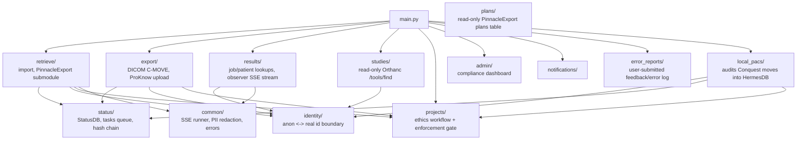

# Domain: backend

> Sub-map of the top-level [ARCHITECTURE.md](../../ARCHITECTURE.md), split out because inlining its full detail would have pushed the top-level map past its size budget.

One FastAPI app (`backend/main.py`) holding every feature; `backend/worker.py` is a separate, plain-synchronous process claiming rows from the `tasks` table and calling the same worker factories the still-synchronous endpoints use.

## Structure

## Key paths

| Component | Path | Description |
|---|---|---|
| App entrypoint | `backend/main.py` | Registers every router; runs Alembic migrations + pool init on startup |
| Worker process | `backend/worker.py` | `python -m backend.worker`; polls `tasks`, no business logic of its own |
| Import | `backend/src/retrieve/logic.py`, `backend/src/retrieve/endpoints.py` | `Importer` class (Mosaiq/Pinnacle/ProKnow search, Orthanc pull, `_cleanup_orthanc`); `PinnacleExport/` git submodule lives under `retrieve/` |
| Export | `backend/src/export/logic.py`, `backend/src/export/endpoints.py` | `Exporter` class: C-MOVE or ProKnow SDK upload |
| Results | `backend/src/results/endpoints.py` | Job/patient lookups, `GET /results/job/{job_id}/stream` observer stream, `_scrub`/`_scrub_json` PII redaction on outbound data |
| Studies | `backend/src/studies/endpoints.py` | Read-only Orthanc `/tools/find` browsing |
| Project/ethics workflow | `backend/src/projects/db_client.py`, `endpoints.py`, `enforcement.py` | `ProjectsDB` (create/submit/review/revoke, membership, audit log); `enforcement.py`'s `require_project_member`/`require_any_active_project`/`verify_internal_key` gate every import/export/project call |
| Status/audit | `backend/src/status/db_client.py` (`StatusDB`), `tasks_db.py` (`TasksDB`), `hash_chain.py`, `audit_chain_db.py` | Job/patient/event tracking, the `tasks` queue (Postgres `SELECT...FOR UPDATE SKIP LOCKED`), the tamper-evident `events` hash chain |
| Anonymisation boundary | `backend/src/identity/anon.py` | `resolve_real_id`/`to_display_id`, `shift_date`; passthrough when `ANON_DB_*`/`ANON_CONFIG` unset |
| Plans | `backend/src/plans/db_client.py` (`PlansDB`) | Read-only access to PinnacleExport's own `plans` table (same Postgres database, separate schema) |
| Notifications | `backend/src/notifications/` | Persisted job-done/approval-decision notifications |
| Error reports | `backend/src/error_reports/db_client.py`, `endpoints.py` | User-submitted feedback/error reports (category, urgent flag, optional job ID); admin-readable log with a persisted `resolved_at`/`resolved_by` addressed state (`mark_addressed`, `POST /error_reports/{id}/resolve`, `unaddressed_only` list filter) |
| Admin | `backend/src/admin/endpoints.py` | Compliance dashboard: project-status counts, expiring-soon list, recent-jobs-with-counts table, audit-chain status |
| Local PACS audit | `backend/src/local_pacs/endpoints.py`, `db_client.py` | `verify_internal_key`-only endpoint (`POST /local_pacs/audit_move`) recording a Conquest-to-destination move (performed entirely in `frontend_fastapi`, never here) into the normal `jobs`/`patients`/`events` hash chain, under an idempotently-bootstrapped sentinel `research_projects` row (`project_id="localPACSTransfer"`); resolves the caller's anon patient ID via `identity/anon.py` before writing. The only backend module in this feature — the actual DICOM C-ECHO/C-FIND/C-MOVE traffic lives in `frontend_fastapi/local_pacs/` since `backend` can't reach Conquest (firewalled) |
| Shared infra | `backend/src/common/sse.py`, `pii_patterns.py`, `errors.py` | `run_batch_job`/`BatchItem` SSE generator; `redact`/`redact_dict` PII floor; global PII-safe exception handler |
| DB pool / migrations | `backend/src/db.py`, `backend/src/database.py`, `backend/alembic/versions/` | Shared `psycopg2` pool (`DATABASE_URL`); Alembic runs on startup |

## Test organisation

`backend/tests/` (43 files) — pytest against a real Postgres, no mocked DB layer. Notable groupings: `test_status_db.py`/`test_projects_db.py`/`test_projects_enforcement.py`/`test_tasks_db.py`/`test_worker.py`/`test_observer_stream.py`/`test_hash_chain.py` (core data-layer + queue behaviour); `test_*_anon_boundary.py` + `test_*_pii_boundary.py` + `backend/tests/support/pii_assertions.py` (the PII-boundary-specific suite, built directly on `pii_patterns.py`); `test_cleanup_orthanc.py`/`test_retrieve_endpoints_errors.py` need the `PinnacleExport` submodule and `pytest.importorskip` if it's absent. `conftest.py`'s `active_project` fixture creates a fully-approved project for tests that need to pass the ethics gate.

## Notable conventions

- `tasks` (mutable queue state) and `events` (immutable audit log) are deliberately separate tables — same mutable/immutable split chosen for `research_projects` vs `project_audit_log`.
- Every outbound response/SSE event goes through the anonymisation boundary (`identity/anon.py`) plus the free-text PII floor (`common/pii_patterns.py`) — see `docs/pii-boundary-safety.md` before touching any new outbound endpoint.
