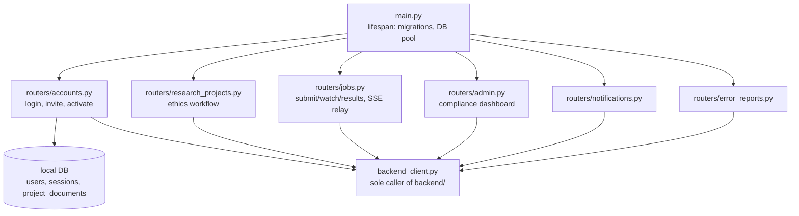

# Domain: frontend_fastapi

> Sub-map of the top-level [ARCHITECTURE.md](../../ARCHITECTURE.md), split out because inlining its full detail would have pushed the top-level map past its size budget.

The production frontend (FastAPI + Jinja2) as of the Phase 5 cutover — sole caller of `backend/` for real traffic. Has its own small local database (users/sessions/`ProjectDocument`s only); all job/event/research-project data is fetched fresh from the backend via `backend_client.py`.

## Structure

## Key paths

| Component | Path | Description |
|---|---|---|
| App entrypoint | `frontend_fastapi/main.py` | Lifespan runs local-DB migrations, opens the shared `httpx.AsyncClient` `backend_client.py` uses |
| Backend client | `frontend_fastapi/backend_client.py` | The ONLY module here that talks to `backend/`; attaches `X-Hermes-Internal-Key` + the session's own username, never a browser-supplied value |
| Sessions/CSRF/auth | `frontend_fastapi/session_middleware.py`, `deps.py`, `auth.py`, `security.py`, `exceptions.py` | Hand-rolled DB-backed sessions (CSRF token + flash messages live on the session row); `NotAuthenticated`/`Forbidden` auth gates; `deps.py`'s `get_template_context` also assembles every staff-only live nav badge count (active-project/expiring-soon, review-queue-pending, unaddressed-urgent-error-reports), each degrading to 0/absent on a backend error rather than failing the page |
| Accounts | `frontend_fastapi/routers/accounts.py`, `forms/accounts.py` | Login, invite, create-user, activate; break-glass scripts: `scripts/reset_password.py`, `scripts/set_staff.py` |
| Research projects | `frontend_fastapi/routers/research_projects.py`, `forms/research_projects.py` | Ethics-project workflow (create/submit/review queue/detail); `models.py`'s `ProjectDocument` is the one HERMES-specific local model (ethics-certificate uploads) |
| Jobs | `frontend_fastapi/routers/jobs.py`, `forms/jobs.py` | Single/batch import, DICOM/ProKnow export (incl. combined import→export), results lookup, job-detail patient drill-down, `job_stream`'s SSE re-framing of the backend's observer stream |
| Admin | `frontend_fastapi/routers/admin.py` | Compliance dashboard, gated by `require_data_custodian`; also the show/hide-addressed toggle and mark-addressed POST action for `error_reports` (`POST /admin/error_reports/{id}/resolve`) |
| Notifications | `frontend_fastapi/routers/notifications.py` | Persisted job-done/approval-decision notifications |
| Error reports | `frontend_fastapi/routers/error_reports.py`, `forms/error_reports.py` | Submission form for the backend's `error_reports` log |
| Templates | `frontend_fastapi/templates/`, `templating.py` | Jinja2; `templating.py` holds the single shared `Jinja2Templates` instance + custom filters (`hermes_timestamp`/`hermes_date`) and the `is_project_expired` global, applied throughout so no template renders a raw ISO timestamp; `templates/base.html` is the shared layout (incl. the live nav badges above), `templates/jobs/dashboard.html` ("Home") the frontpage recent-jobs table, `templates/research_projects/_macros.html`'s `project_table` the shared table-row macro for the projects list/review-queue pages |
| Local DB / migrations | `frontend_fastapi/models.py`, `database.py`, `migrations.py`, `alembic/` | `HERMES_FRONTEND_DATABASE_URL` (defaults to local SQLite); migrations run automatically on startup, same pattern as the backend |

## Test organisation

`frontend_fastapi/tests/` (26 files), pytest, own local DB (SQLite in-memory or throwaway Postgres). `backend_client`'s functions are monkeypatched with `AsyncMock` across most router tests (see `test_jobs.py`/`test_research_projects.py`'s `mock_backend` fixture pattern) rather than hitting a real backend.

## Notable conventions

- Project selection has no implicit/session concept — every submission form carries its own `project_id`, populated fresh from `backend_client.list_user_active_projects` on every request; the form's own validation against those live choices is the re-check that the submitted `project_id` is still one the user has active access to.
- Every batch job is enqueued directly onto the backend's task queue from the submit route — nothing is staged to local disk or session first, so `job_watch`/`job_stream` re-check live visibility on every request rather than trusting anything cached from submission time.
