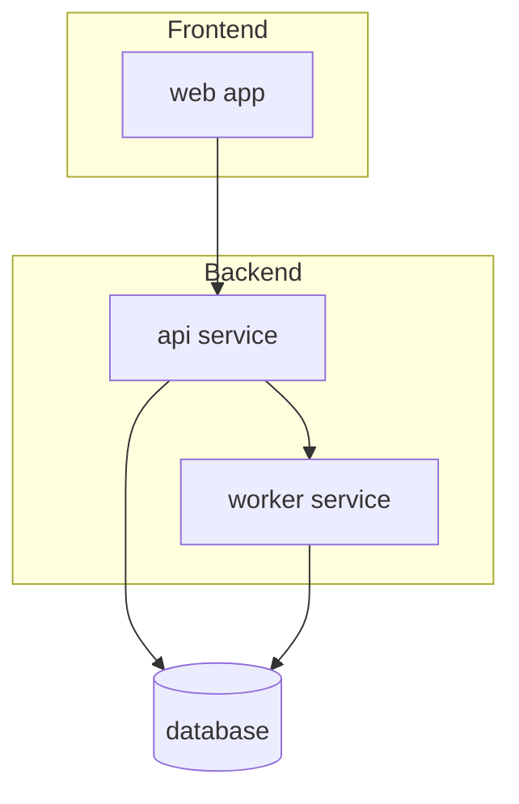

# Architecture Map

> Generated by the `architecture-map` skill. This is a structural orientation aid, not a source of truth for business logic or specific behaviour — verify anything load-bearing against the actual code.
>
> Domains with substantial detail are split into `.architecture/domains/<domain>.md` — follow the link in the table below rather than expecting everything inline here.

## Structure overview

<Replace with the actual domain/service-level boundaries and dependencies. Keep nodes at domain/service granularity, not individual files or classes — this diagram is meant to stay readable at a glance (roughly 10-20 nodes), not enumerate everything.>

## Domains

| Domain | Path | Description | Details |
|---|---|---|---|
| `<domain>` | `<path>` | <one-line description> | <link to `.architecture/domains/<slug>.md`, or "—" if not split out> |

## Apps / packages

| Name | Path | Description |
|---|---|---|
| `<name>` | `<path>` | <what it is> |

## Frontend / backend boundaries

<Where the split is, if any, and how the sides communicate. Prose is fine here — this rarely has enough discrete items to need a table.>

## Test organisation

<Where tests live, naming conventions, test levels in use, repo-wide. Domain-specific test conventions that differ from this belong in that domain's sub-map instead.>

## Build / package configuration

<Build tooling, package manifests, key config files.>

## Developer & architecture docs

| Doc | Path |
|---|---|
| `<name>` | `<path>` |

## Notable conventions

<Anything else useful for orientation: monorepo tooling, codegen, linting, etc.>
