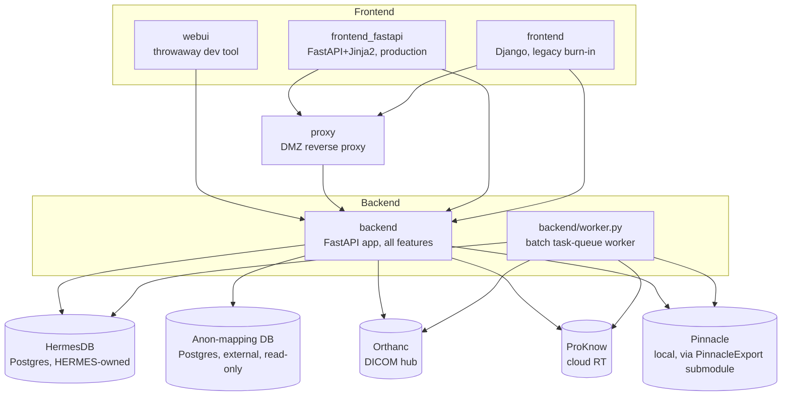

# Architecture Map

> Generated by the `architecture-map` skill. This is a structural orientation aid, not a source of truth for business logic or specific behaviour — verify anything load-bearing against the actual code. For business-logic detail, see `CLAUDE.md` (module-by-module) and `docs/architecture.md` (narrative walkthrough).

## Structure overview

`frontend_fastapi`/`frontend` call `backend` directly when internal-only, or via `proxy` when externally/DMZ-reachable — both paths are the same code, just a different `BACKEND_URI`.

## Domains

| Domain | Path | Description | Details |
|---|---|---|---|
| `backend` | `backend/src/` | FastAPI app: import/export/results/studies/projects, task queue, audit trail, anonymisation boundary | [.architecture/domains/backend.md](.architecture/domains/backend.md) |
| `worker` | `backend/worker.py` | Polls the `tasks` table, executes queued batch-job rows via the same worker factories the sync endpoints use | — |
| `frontend_fastapi` | `frontend_fastapi/` | Production frontend (FastAPI + Jinja2): auth, ethics workflow, job submission/results, admin dashboard | [.architecture/domains/frontend_fastapi.md](.architecture/domains/frontend_fastapi.md) |
| `frontend` (legacy) | `frontend/` | Django app `frontend_fastapi` replaced; kept running only for Phase 6 decommission burn-in, no new features | — |
| `webui` (throwaway) | `webui/` | Minimal Django test UI, superseded by `frontend`/`frontend_fastapi`. On this branch its source (`webui/core/`) has already been removed (see the "Repo cleanup" commit) — only a stray `db.sqlite3` remains; `CLAUDE.md`'s description of it as a working (if broken-on-import/export) app is stale | — |
| `proxy` | `proxy/` | Thin SSE-aware reverse proxy for external/DMZ access; zero business logic | — |

## Apps / packages

| Name | Path | Description |
|---|---|---|
| `backend` | `backend/` | FastAPI backend + worker; `src/` holds one subpackage per feature domain (see backend sub-map) |
| `frontend_fastapi` | `frontend_fastapi/` | FastAPI + Jinja2 frontend, its own local SQLite/Postgres DB (`HERMES_FRONTEND_DATABASE_URL`) for users/sessions/documents only |
| `frontend` | `frontend/` | Django app: `accounts`, `research_projects`, `jobs` — legacy, burn-in only |
| `webui` | `webui/` | Formerly a Django dev-only test UI (`webui/core/`, no auth/styling); that source is now deleted from this branch, leaving only a stray `db.sqlite3` |
| `proxy` | `proxy/` | FastAPI, single catch-all forwarding route (`main.py`, `forward.py`) |
| `scripts` | `scripts/` | Repo-level dev tooling, e.g. `dev-up.sh` (starts backend + worker + `frontend_fastapi` together) |

## Frontend / backend boundaries

`frontend_fastapi/` is the sole caller of `backend/` for real traffic (as of the Phase 5 cutover); `frontend/` (Django) remains wired the same way but isn't used for live traffic during its burn-in period. Both talk to the backend exclusively through one client module each (`frontend_fastapi/backend_client.py`, `frontend/hermes_frontend/backend_client.py`) — HTTP + SSE, with an optional shared-secret header (`X-Hermes-Internal-Key`, checked by `backend/src/projects/enforcement.py`'s `verify_internal_key`) when `HERMES_INTERNAL_KEY` is set. `webui/` also calls the backend directly but has no auth of its own and its import/export pages now 422 (ethics-gate fields it never sends).

`proxy/` sits between an external-facing frontend and the backend only when needed (DMZ deployments) — it is a transparent relay, never itself a caller.

The backend has no authentication of its own; every import/export/project endpoint is gated by `backend/src/projects/enforcement.py` (ethics/project-membership checks), with `HERMES_INTERNAL_KEY` as the only enforcement that "only the frontend calls this" is real rather than just topological.

## Test organisation

- `backend/tests/` — pytest against a real Postgres (`DATABASE_URL`, throwaway container; `conftest.py` refuses to run against a non-loopback host). Covers `StatusDB`, `ProjectsDB`/enforcement, the anon boundary, the hash chain, the `tasks` queue, the worker, the observer SSE stream, and PII-boundary-specific assertions (`backend/tests/support/pii_assertions.py`). Files needing the `PinnacleExport` submodule skip gracefully via `pytest.importorskip` if it isn't checked out.
- `frontend_fastapi/tests/` — pytest, own local DB (SQLite in-memory or throwaway Postgres via `HERMES_FRONTEND_DATABASE_URL`). Covers sessions/CSRF, auth deps, each router, the backend client, migrations, break-glass scripts.
- CI (`.github/workflows/test.yml`) runs only `backend/tests/` today, on Python 3.13 (required by `PinnacleExport`'s own typing), against two ephemeral Postgres containers (HermesDB + anon-DB stand-in), with `--continue-on-collection-errors`.

## Build / package configuration

- Root `requirements.txt` / `requirements-dev.txt` cover backend + `frontend_fastapi` + the still-present Streamlit remnants.
- `proxy/` and `webui/` have their own `pyproject.toml`/requirements; every other component pins via the root files.
- `docker-compose.dev.yml` + `Dockerfile.dev` bring up the full local stack (both Postgres DBs, `backend`, `worker`, `frontend_fastapi`, `frontend`). `docker-compose.yml` is the production compose file and has no frontend service of its own — routing is handled outside this repo.
- Backend DB migrations: Alembic, `backend/alembic/versions/` (run automatically on backend startup). `frontend_fastapi` migrations: `frontend_fastapi/migrations.py`, also automatic on startup.

## Developer & architecture docs

| Doc | Path |
|---|---|
| Main contributor guide (module-by-module) | `CLAUDE.md` |
| Narrative architecture walkthrough | `docs/architecture.md` |
| Known issues / accepted gaps | `docs/known-issues.md` |
| PII boundary risk register | `docs/pii-boundary-safety.md` |
| Frontend rewrite implementation plan | `docs/plans/frontend-rewrite-implementation-plan.md` |
| Worker queue design | `docs/plans/worker-queue-design.md` |
| Safety plan (audit trail, export manifest, etc.) | `docs/plans/safety-plan.md` |
| Feature-round implementation plan (this round's items) | `docs/plans/feature-round-implementation-plan.md` |

## Notable conventions

- One feature per git branch/PR is the established pattern for this "feature round" (e.g. `feature/change-own-password`, `feature/frontpage-jobs-table`) — see `.plans/hermes-feature-round/` for the per-feature specs (`F001`-`F011`) this round is tracked against, a more granular breakdown than `docs/plans/feature-round-implementation-plan.md`'s unlabeled items.
- Two entirely separate Postgres databases exist — HermesDB (`DATABASE_URL`, HERMES-owned) and the anon-mapping DB (`ANON_DB_*`, external, read-only) — never conflate them. A third, `PINNACLE_SCHEMA`-namespaced set of tables lives inside HermesDB's own database but is owned and migrated entirely by the separate `PinnacleExport` project; HERMES only ever `SELECT`s from it.
- `backend/src/retrieve/PinnacleExport/` is a git submodule; several backend tests and this whole map's `backend.retrieve` domain assume it's checked out (`git submodule update --init --recursive`).
