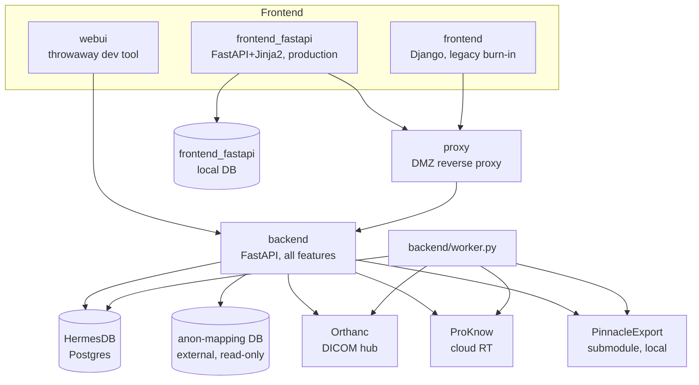

# Architecture Map

> Generated by the `architecture-map` skill. This is a structural orientation aid, not a source of truth for business logic or specific behaviour — verify anything load-bearing against the actual code. For business-logic detail, see `CLAUDE.md` (module-by-module) and `docs/architecture.md` (narrative walkthrough).

## Structure overview

`frontend_fastapi/` is the sole caller of `backend/` for real traffic (Phase 5 cutover); `frontend/` (Django) is kept running only for burn-in/rollback. `webui/` talks to `backend/` directly but its import/export routes are broken (ethics-gate 422s). `proxy/` is an optional pass-through, used only when a frontend is DMZ-facing.

## Domains

Backend domains (`backend/src/`) — one FastAPI app, organised by subpackage:

| Domain | Path | Description | Details |
|---|---|---|---|
| `retrieve` | `backend/src/retrieve/` | Import: Mosaiq/Pinnacle/ProKnow search, DICOM pull to Orthanc, Orthanc cleanup | — |
| `export` | `backend/src/export/` | Export: DICOM C-MOVE to registered modalities, ProKnow SDK upload | — |
| `studies` | `backend/src/studies/` | Read-only study/series browsing against Orthanc | — |
| `identity` | `backend/src/identity/` | Anon ⇄ real ID translation boundary (`anon.py`) | — |
| `plans` | `backend/src/plans/` | Read-only access to PinnacleExport's own `plans` table | — |
| `status` | `backend/src/status/` | Job/patient/event audit log (`StatusDB`) and the `tasks` queue (`TasksDB`), plus the hash chain | — |
| `projects` | `backend/src/projects/` | Ethics/research-project workflow: lifecycle, membership, audit log, enforcement gate | — |
| `notifications` | `backend/src/notifications/` | Persisted job-done/approval-decision notifications | — |
| `admin` | `backend/src/admin/` | Compliance dashboard aggregate queries (project-status counts, expiring-soon, recent jobs, audit-chain status) | — |
| `common` | `backend/src/common/` | Shared SSE batch runner, PII redaction (`pii_patterns.py`), global exception handling | — |

`frontend_fastapi/` mirrors most of the same domain names as its own routers/forms (`accounts`, `research_projects`, `jobs`, `admin`, `notifications`) — it is a thin UI layer over the backend API, holding no job/event/project data itself (see Frontend/backend boundaries below).

## Apps / packages

| Name | Path | Description |
|---|---|---|
| `backend` | `backend/` | FastAPI app, all business logic; `backend/worker.py` is a separate long-running process from the same source tree |
| `frontend_fastapi` | `frontend_fastapi/` | FastAPI + Jinja2 app — **production frontend** as of the Phase 5 cutover; sole caller of `backend` |
| `frontend` | `frontend/` | Django (ASGI) app — legacy frontend `frontend_fastapi` replaced; kept running for Phase 6 burn-in only, not real traffic |
| `webui` | `webui/` | Throwaway Django dev tool for exercising `backend` directly; import/export routes broken (ethics gate) |
| `proxy` | `proxy/` | Thin FastAPI reverse proxy for DMZ/external access; no business logic or database |
| `docs` | `docs/` | Narrative docs and `docs/plans/` (design/implementation plan documents) |
| `docs/agents` | `docs/agents/` | Agent-skill config: issue tracker, triage labels, domain-doc conventions (see `CLAUDE.md`'s "Agent skills" section) |

`backend/src/retrieve/PinnacleExport/` is a git submodule (Pinnacle DICOM export) — not part of this repo's own source.

## Frontend / backend boundaries

`backend/` exposes one FastAPI app (`/studies`, `/import`, `/export`, `/results`, `/projects`) and has no authentication of its own beyond an optional shared-secret header (`HERMES_INTERNAL_KEY`). `frontend_fastapi/` (and, before it, `frontend/`) is the only intended caller: it session-authenticates the human, then issues every backend call server-side — including SSE streams — via its own `backend_client.py`, attaching `project_id`/`username` itself rather than trusting a browser-supplied value. `frontend_fastapi/` holds only its own local concerns (`users`, `sessions`, `project_documents`) in a separate local DB; all job/event/research-project *data* is fetched fresh from the backend on every request, never cached or duplicated locally. `webui/` and `proxy/` both talk to the backend directly instead, for different reasons (dev convenience vs. DMZ relay respectively).

## Test organisation

- `backend/tests/` — pytest, needs a real Postgres (`DATABASE_URL`); no mocked/in-memory DB layer. `conftest.py` refuses to run against a non-loopback host as a safety guard. Some tests additionally need the `PinnacleExport` submodule or a second throwaway anon-mapping Postgres; both skip gracefully when absent.
- `frontend_fastapi/tests/` — pytest, uses its own local DB (SQLite in-memory or throwaway Postgres via `HERMES_FRONTEND_DATABASE_URL`), separate fixtures from the backend's.
- `frontend/*/tests.py` — Django's default per-app test module convention (`accounts/tests.py`, `jobs/tests.py`, `research_projects/tests.py`); legacy app, lower priority for new coverage.
- CI (`.github/workflows/test.yml`) runs `backend/tests/` only, against two ephemeral Postgres 16 containers, on Python 3.13 specifically (see `CLAUDE.md` Testing section for why).

## Build / package configuration

- `pyproject.toml` (repo root) — `pytest` config (`asyncio_mode = "auto"`) and a `[tool.fastapi]` entrypoint; no per-component `pyproject.toml` beyond `proxy/` and `webui/`.
- `requirements.txt` / `requirements-dev.txt` (repo root) — cover `backend` + `frontend_fastapi` + Streamlit remnants; single shared dependency set.
- `Dockerfile`, `Dockerfile.dev`, `docker-compose.yml`, `docker-compose.dev.yml` — dev compose brings up both Postgres DBs, `backend`, `worker`, `frontend_fastapi`, and `frontend` together; root compose has no frontend service of its own (production routing handled outside this repo).
- `scripts/dev-up.sh` — starts backend + worker(s) + `frontend_fastapi` together for local dev (`HERMES_DEV_USE_DJANGO_FRONTEND=1` switches to legacy `frontend/`).
- Alembic migrations: `backend/alembic/versions/` (HermesDB, 7 revisions) and `frontend_fastapi/alembic/versions/` (frontend's own local DB, 3 revisions) — two independently-migrated databases, never share a migration chain.

## Developer & architecture docs

| Doc | Path |
|---|---|
| Full module-by-module reference | `CLAUDE.md` |
| Narrative architecture walkthrough | `docs/architecture.md` |
| Known gaps / historical governance findings | `docs/known-issues.md` |
| PII boundary risk register | `docs/pii-boundary-safety.md` |
| Frontend rewrite phase plan | `docs/plans/frontend-rewrite-implementation-plan.md` |
| Worker queue design | `docs/plans/worker-queue-design.md` |
| Safety-plan (export governance) | `docs/plans/safety-plan.md` |
| Current feature-round plan | `docs/plans/feature-round-implementation-plan.md` |

## Notable conventions

- Two entirely separate Postgres databases exist (HermesDB and the external anon-mapping DB) plus `frontend_fastapi`'s own local DB — never conflate them; see `CLAUDE.md`'s "Environment Variables" and "Architecture" sections.
- A third, non-HERMES-owned schema (`pinnacle_export`, default) lives inside HermesDB's own database — PinnacleExport's own tables, read-only to HERMES, never migrated by this repo's Alembic chain.
- CSV-upload batch jobs run through a Postgres-backed `tasks` queue (`backend/worker.py`), not inline in the HTTP request; the older in-request SSE generator (`backend/src/common/sse.py`) still exists for a narrower non-file "list of MRNs" alias path.
- `mrn` columns in HermesDB store the real patient ID; anonymisation is strictly a boundary concern at the API edge (`backend/src/identity/anon.py`), not something reflected in storage.
