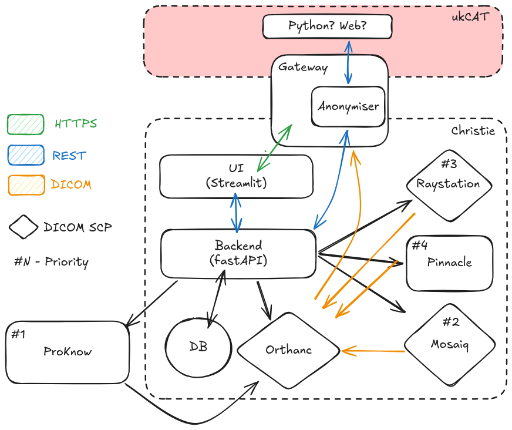

### Handles Everything: Receive, Modify, Export Stuff

Web-app for exporting plans from all data sources (Pinnacle, Raystation, Mosaiq).

## Outline
*1. Receive*: Centralises data across data sources. Will import data (granularity specified by `import_level`) from MOSAIQ, Pinnacle (via PinnacleExport) and Raystation (*TODO*) into a single Orthanc node (specified by `ORTHANC_URL`).

*2. Modify*: Not implemented

*3. Export*: Exports data from Orthanc to other DICOM nodes (need to be registered as Orthanc Modalities) or to ProKnow.

## System Architecture

## TODO
- Update to use central orthanc
- Link MosaiqDataDirector with Central Orthanc
- Handle CBCT exports, export all images option
