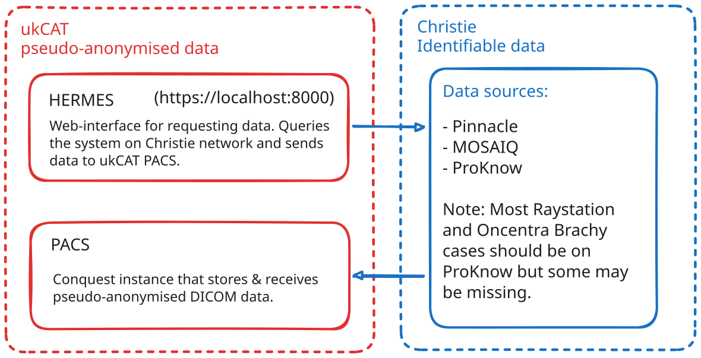

## Handles Everything: Restore, Modify, Export Stuff

Web-app for restoring and exporting plans from radiotherapy systems.

## Outline
*1. Restore*: Centralises data across data sources. Imports data (granularity specified by `import_level`) from MOSAIQ, Pinnacle (via PinnacleExport) and Raystation (*TODO*) into a single Orthanc node (specified by `ORTHANC_URL`).

*2. Modify*: Not implemented

*3. Export*: Exports data from Orthanc to other DICOM nodes (need to be registered as Orthanc Modalities) or to ProKnow.

## System Architecture


One FastAPI backend (`backend/`) holds every feature; one or more `backend/worker.py` processes execute queued batch import/export jobs. An optional thin reverse proxy (`proxy/`) can sit in front of the backend on a separate machine for external access. `frontend_fastapi/` (FastAPI + Jinja2) is the production frontend as of the Phase 5 cutover — the sole caller of the backend. `frontend/` (Django) is kept around only for the Phase 6 decommission burn-in period; see Known Issues below.

See [`docs/architecture.md`](docs/architecture.md) for a concise architecture reference (diagrams included), or `CLAUDE.md` for the full writeup (anonymisation boundary, database layout, every module).

## Getting Started

### Prerequisites

- Python 3.11+
- A reachable PostgreSQL instance (for `DATABASE_URL` — job/event tracking; the backend and worker share it)
- The `PinnacleExport` git submodule, if you need Pinnacle import/export to actually work:
  ```bash
  git submodule update --init --recursive
  ```
- An Orthanc instance, and `credentials.json` for ProKnow, if you need those integrations live. The backend will still start without them — you'll just get errors from the specific endpoints that need them.

```bash
pip install -r requirements.txt
# for running the test suite too:
pip install -r requirements-dev.txt
```

`requirements.txt` covers the backend, the worker, and `frontend_fastapi/`. `proxy/` and `webui/` have their own, smaller dependency lists (see `proxy/pyproject.toml` / `webui/pyproject.toml`) since they're run as separate processes with much narrower needs.

**Fastest path to a full local stack**: `docker compose -f docker-compose.dev.yml up` brings up both Postgres databases, the backend, a worker, `frontend_fastapi/` (port 8010, the production frontend), and `frontend/` (port 8011, legacy Django, kept for the Phase 6 burn-in period) together, with dev users pre-seeded. See that file's comments for details.

**Already have Postgres running and just want backend + worker + frontend without Docker?** `./scripts/dev-up.sh` starts backend + worker(s) + `frontend_fastapi/` (one worker by default — set `HERMES_DEV_WORKERS=3` for more) in a single terminal, interleaved and prefixed by process, and stops all of them together on Ctrl-C. Set `HERMES_DEV_USE_DJANGO_FRONTEND=1` to run the legacy Django frontend instead. The manual steps below are the alternative if you want to run pieces individually.

### 1. Configure

Copy `.env.example` to `.env` at the repo root and fill it in — at minimum `ORTHANC_URL`/`ORTHANC_USER`/`ORTHANC_PASS` and `DATABASE_URL` (a Postgres DSN). See the comments in `.env.example` for everything else (`ANON_DB_*` is optional and only needed for external/anonymised deployments).

### 2. Run the backend

```bash
fastapi run backend/main.py
# or, with hot reload:
python -m uvicorn backend.main:app --reload
```

It exits immediately if `DATABASE_URL` isn't set. On startup it runs its Alembic migrations automatically against that database, so an empty Postgres database is all you need — no manual schema setup.

### 3. Run the worker

CSV-upload import/export jobs are processed asynchronously by a separate worker process, not inline in the backend request:

```bash
python -m backend.worker
```

Run more than one process to process jobs in parallel — each claims one task at a time off a Postgres queue, so this is safe without extra coordination. See `CLAUDE.md`'s Worker section for details.

After deploying (or restarting) the worker, `python backend/scripts/check_worker_health.py` confirms its periodic hooks (audit-chain verification, job-completion notifications) are actually running — neither has any frontend-visible symptom if it silently isn't (e.g. an old worker process still on pre-Phase-4 code).

### 4. Run a frontend

**`frontend_fastapi/`** (FastAPI + Jinja2) is the production frontend — the place to actually run an import/export job end-to-end, as of the Phase 5 cutover:

```bash
python -m uvicorn frontend_fastapi.main:app --reload
```

(Migrations for its own local DB run automatically on startup — no separate migrate step.)

**`frontend/`** (Django) is the legacy frontend it replaced, kept running only for the Phase 6 decommission burn-in period:

```bash
cd frontend
python manage.py migrate
python -m uvicorn hermes_frontend.asgi:application --reload
```

Both point at the backend via `BACKEND_URI`/`BACKEND_PORT` (already set in your `.env` from step 1).

### 5. Run the throwaway UI (`webui/`), optional

A minimal Django app for exercising the backend by hand, superseded by `frontend/`. Its Import/Export pages currently 422 (the ethics gate requires fields it doesn't send) — Results pages still work.

```bash
cd webui
python manage.py migrate   # once, sets up Django's own local session/admin DB
python manage.py runserver 8080   # backend's own default port is also 8000, so pick something else here
```

Then visit `http://127.0.0.1:8080/`.

### 6. Run the tests

Run from the **repo root** (not from inside `backend/` — the tests import `backend.src...` as a package, which only resolves from the root):

```bash
DATABASE_URL="postgresql://<user>:<pass>@<host>:<port>/<db>" python -m pytest backend/tests/
python -m pytest frontend_fastapi/tests/
```

Tests need a real Postgres reachable via `DATABASE_URL` — there's no mocked/in-memory DB layer. A throwaway container works fine for this:

```bash
docker run --rm -d -p 5432:5432 -e POSTGRES_PASSWORD=test -e POSTGRES_DB=hermes_test postgres:16-alpine
```

`test_cleanup_orthanc.py` and a couple of others additionally need the `PinnacleExport` submodule checked out (see Prerequisites above) — they skip themselves gracefully if that submodule isn't present.

## Known Issues / TODO

The full, current list lives in `CLAUDE.md`'s "Known Gaps / TODO" section — this is the short version:

- **Frontend rewrite cut over**: `frontend_fastapi/` is now the production frontend (Phase 5). `frontend/` (Django) is deprecated, kept only for the Phase 6 decommission burn-in period — see `docs/plans/frontend-rewrite-implementation-plan.md`. `frontend_fastapi/scripts/migrate_from_django.py` migrates existing users/documents from `frontend/`'s local DB (dry-run by default).
- Raystation import not implemented; metadata editing ("Modify") not implemented
- CBCT export and "all images" export option pending
- Per-user export destination allow-list not built — any active project member can currently target any registered export destination
- See `docs/known-issues.md` / `docs/safety-plan.md` for the fuller export-governance picture (most findings there have since been addressed — hash-chained audit log, export manifests, per-source import failure reasons — a few, like the allow-list above, remain open)
