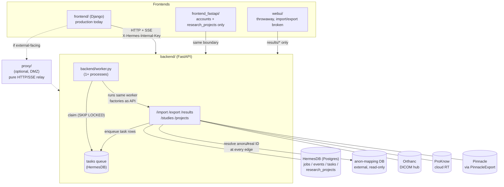
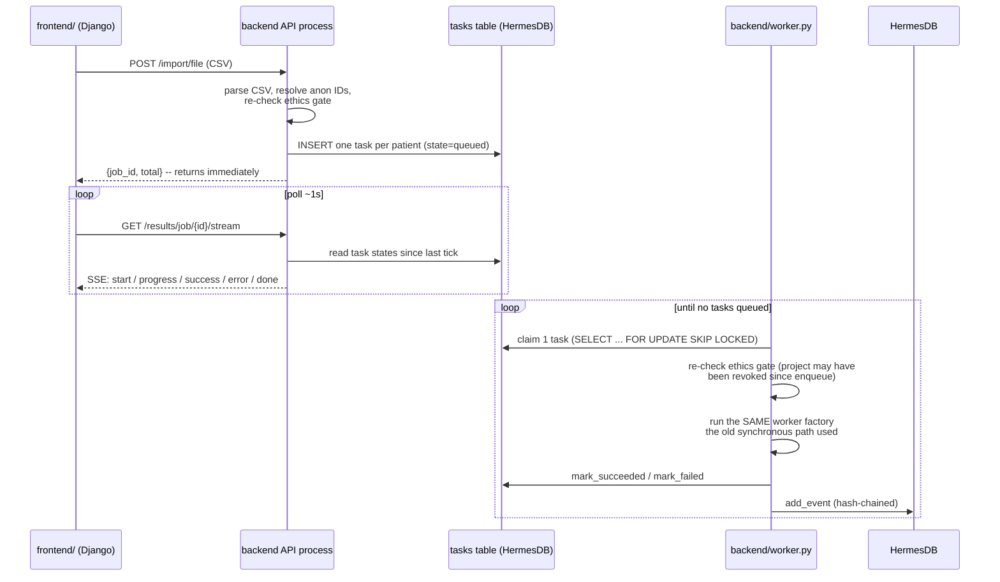
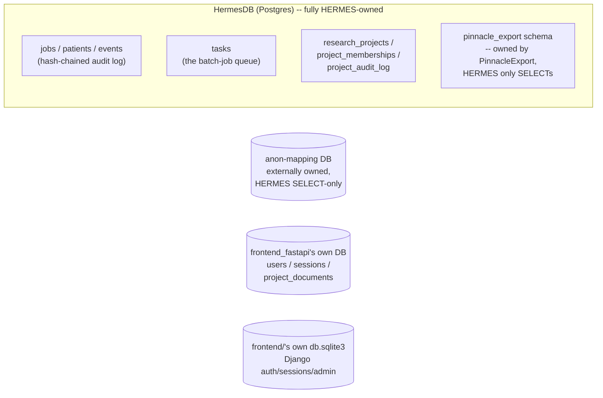

# HERMES architecture reference

A quick-scan companion to `CLAUDE.md` (which has full module-by-module detail). This doc is for getting oriented: what talks to what, where a request goes, and where the real complexity lives. Read `CLAUDE.md` for anything you need to actually change.

## What it does

HERMES centralises radiotherapy planning data from three sources (Mosaiq, Pinnacle, Raystation *[not yet built]*) into one Orthanc DICOM server, then exports it out again to DICOM modalities or ProKnow. Access is gated by an ethics/research-project approval workflow — nobody imports or exports without active, approved project membership.

## Components at a glance

| Component | What it is | Status |
|---|---|---|
| `backend/` | FastAPI app — every feature (import, export, results, studies, projects) | Production |
| `backend/worker.py` | Claims and executes queued batch import/export jobs | Production |
| `frontend/` | Django (ASGI) — the app users actually interact with | Production, being replaced |
| `frontend_fastapi/` | FastAPI + Jinja2 rewrite of `frontend/` | In progress — auth + ethics workflow only, no `jobs/` yet |
| `proxy/` | Thin reverse proxy for external/DMZ access | Production, optional |
| `webui/` | Throwaway Django dev tool | Deprecated (import/export broken) |

## Component diagram

**Real patient IDs never cross the proxy or an external-facing frontend.** When `ANON_DB_*` is configured, the backend resolves anon → real IDs on the way in and real → anon on the way out, at its own API edge — including free text (error messages, worker `details`) that might otherwise quote an MRN.

## Batch job lifecycle (the interesting part)

CSV-upload import/export jobs used to run *inside* the HTTP request via an SSE generator — the work died if you closed the tab. They now go through a Postgres-backed queue instead:

Net effect: closing the browser tab no longer kills the job, a refresh doesn't lose it, a colleague with project access can watch it, and multiple workers give real parallelism. See `docs/worker-queue-design.md` for the full design and `CLAUDE.md`'s Key Design Patterns for the exact SSE event vocabulary. Single-patient import/export and the legacy "list of MRNs" batch alias still run the old synchronous SSE-in-request path — the queue is specifically for CSV-upload batches.

**Combined import→export jobs**: `frontend/`'s "Submit a job" page (`jobs:submit_job`, its "Also export" checkbox) submits one job that does both — `backend/worker.py`'s `_maybe_chain_export` enqueues a matching export task on the same `job_id` once a patient's import succeeds, so nobody has to come back and start a second export job by hand. See CLAUDE.md's "Chained export" pattern for the ordering/dedup details that make this safe under a multi-worker, at-least-once queue.

## Data layout — four separate databases, never conflate them

- **HermesDB** (`DATABASE_URL`) — the backend's own database, freely migrated with Alembic. `tasks` is the queue; `events` is the immutable, hash-chained audit trail; `pinnacle_export.*` is a schema inside the same database that PinnacleExport owns and migrates itself — HERMES never writes there.
- **The anon-mapping DB** (`ANON_DB_*`) — external, Trust-owned, read-only. Unset → no anonymisation (fine for internal-only deployments).
- **`frontend_fastapi/`'s own DB** (`HERMES_FRONTEND_DATABASE_URL`) — just users/sessions/ethics-document uploads. All job/project *data* is fetched fresh from the backend API, never duplicated here.
- **`frontend/`'s `db.sqlite3`** — Django's own auth/session/admin tables, same idea.

## Security boundaries worth knowing before you touch anything here

1. **Ethics gate** (`backend/src/projects/enforcement.py`) — every import/export call requires an approved, active project membership, re-checked live (never cached), fail-closed on DB error. Re-checked *again* at task-claim time for queued jobs, since a project can be revoked between enqueue and execution.
2. **`HERMES_INTERNAL_KEY`** — a shared secret that makes "only the frontend calls the backend" actually enforced rather than just topologically true. Optional (no-op if unset) — treat as required whenever the backend is reachable from outside the secured network. During the `frontend_fastapi/` migration, **two** frontends carry this key, not one.
3. **Anonymisation boundary** (`backend/src/identity/anon.py`) — real IDs resolved in, anon IDs translated out, at the backend's own API edge. Passthrough when unconfigured.
4. **Audit trail** — `events` rows are hash-chained (`backend/src/status/hash_chain.py`); tampering breaks verification (`backend/scripts/verify_audit_chain.py`). Export jobs record a manifest (counts, UIDs, checksums) rather than a bare success flag.

None of this bounds *what* an approved project member can export, only *whether* they can — see `docs/known-issues.md` for the accepted governance gaps (no cohort/volume scoping, no destination allow-list yet).

## Where things stand

- **Backend**: mature — Mosaiq/Pinnacle/ProKnow import, DICOM/ProKnow export, the ethics gate, the queue, and the audit trail are all in production use.
- **Frontend**: mid-migration. `frontend/` (Django) is the only complete, production-usable UI today. `frontend_fastapi/` has working auth and the ethics-project workflow (Phases 0–2 of `docs/frontend-rewrite-implementation-plan.md`) but no import/export/results pages yet (Phase 3+).
- **Known gaps**: Raystation import, metadata editing, CBCT/all-images export, and a per-user export destination allow-list are the main outstanding backend items. See `CLAUDE.md`'s "Known Gaps / TODO" for the complete, current list.
